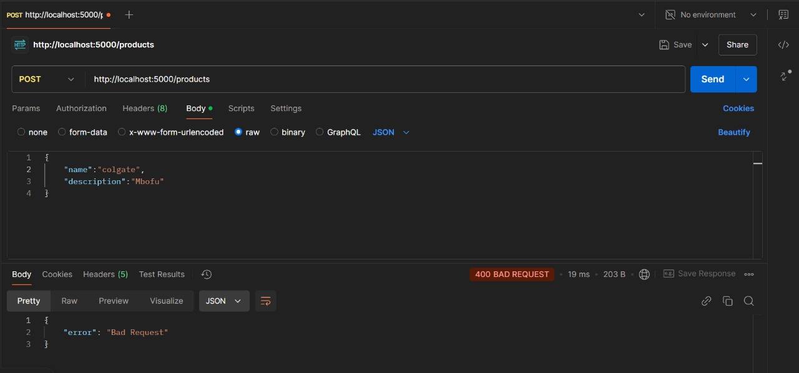

# RestAPI

1. # Clone the repository:*

   git clone "https://github.com/Chies22/RestAPI.git"
   cd "RestAPI"

2. # creating a virtual n          
    Create: "python -m venv venv"
    Activate: ".\.venv\Scripts\Activate.ps1"

3. # installation of dependencies
     pip install -r requirements.txt

4. # running the API
     python app.py it has the method Checking which is just used to confirm if everything is well set

5. # Testing the POST and GET methods used to create a product and to get all the products created
      Install postman software
      Using the URL: 'http://localhost:5000/products' create a product and then observe the output port from postman.
      Alternative way of creating a product using gitbash(Note that the virtual environment must be activated using the command . .venv/Scripts/Activate) where you run this command:curl -X POST -H "Content-Type: application/json" -d '{"name": "rice", "description": "30 kilos", "price": 400}' http://127.0.0.1:5000/products but also ensuring that the file app.py is running and then the path in gitbash is set. 

      To get all the products created type this command: curl http://127.0.0.1:5000/products and it produces the output of all the products created.
      Created Product(postman):